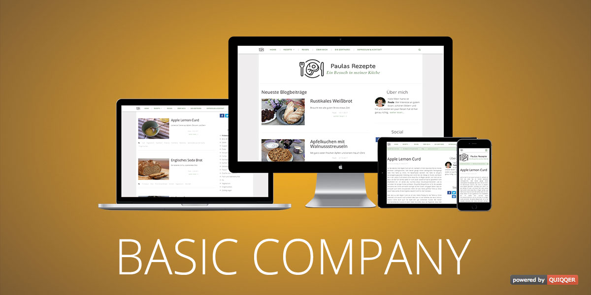

QUIQQER Basic Company
=====================

Basic template for small and middle sized enterprises with a lot of settings to customize your website. 
The template supports most of the standard QUIQQER modules and plugins (news, blog, standard bricks, etc.).

Package name:

    quiqqer/template-basiccompany

Features
--------

- Responsive
- QUIQQER breadcrumb integrated
- Page transitions effects
- FontAwesome icons support
- Color management
- Header settings (show / hide) dependent on page layout
- Top nav fixed or scrolled
- Max page width, to create a traditional website
- Site settings: title, short description and header
     

Installation
------------

Der package name is: quiqqer/template-basiccompany

Contribute
----------

- Issue Tracker: https://dev.quiqqer.com/quiqqer/template-basiccompany/issues
- Source Code: https://dev.quiqqer.com/quiqqer/template-basiccompany

Support
-------

If you have found a bug or want to make improvements,
then you can write an e-mail to support@pcsg.de.

License
-------

GPL-3.0+